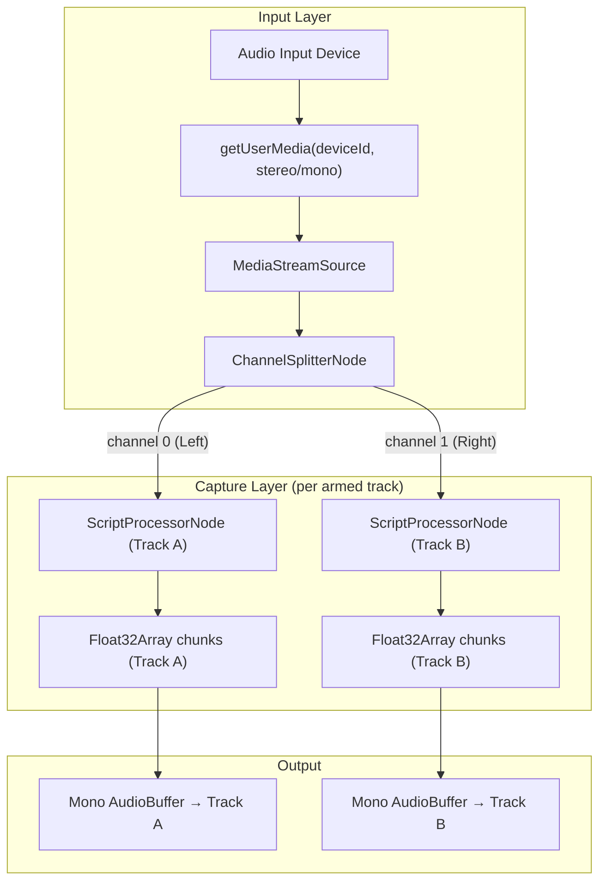
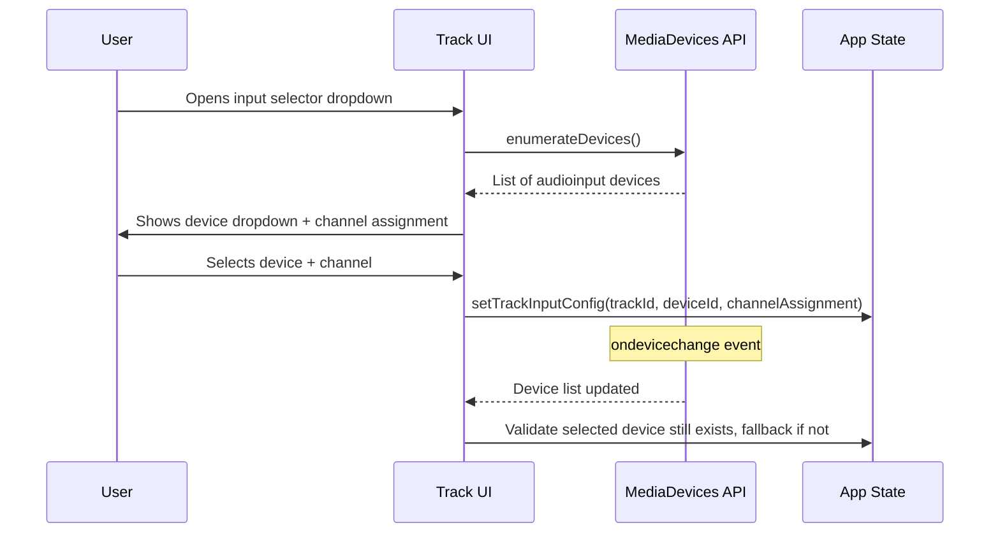

# Design Document: Mono Track & Stereo Recording

## Overview

This design converts MultiTracker Studio from implicit stereo tracks to explicit mono tracks, adds per-track audio input device selection with channel assignment, and enables simultaneous dual-track stereo recording. The core change is that every track stores and processes a single mono channel. Stereo imaging is achieved exclusively through the existing `StereoPannerNode` at the end of each track's effects chain. Stereo sources are captured by arming two tracks — one for Left, one for Right — and splitting the stereo input via a `ChannelSplitterNode`.

### Key Design Decisions

1. **Mono buffers everywhere**: All `AudioBuffer` objects stored on tracks use `numberOfChannels = 1`. Imported stereo files are split into two mono tracks (left channel panned left, right channel panned right) to preserve the original stereo image. Files with more than 2 channels are downmixed to mono. This simplifies the audio graph and makes pan control unambiguous.
2. **Channel assignment on the track, not the device**: Each track stores a `channelAssignment` (`'mono'`, `'left'`, `'right'`) alongside a `inputDeviceId`. This keeps the device enumeration generic and lets the recording engine decide how to wire the `ChannelSplitterNode`.
3. **Multi-arm with a Set, not a single ID**: The current `armedTrackId` (single string) is replaced with `armedTrackIds` (a `Set` of up to 2 track IDs). This supports simultaneous dual-track recording while keeping the single-track case simple.
4. **Recording engine refactor**: `useAudioRecording` is refactored to accept an array of armed track descriptors (id, deviceId, channelAssignment) and manage per-track `ScriptProcessorNode` capture internally, replacing the current single-stream approach.
5. **No new services**: All changes fit within the existing architecture — `AudioEngine`, `useAudioRecording`, `App.js` state, and UI components. No new singleton services are introduced.

## Architecture

### Current Audio Graph (per track)

```
GainNode → EQ → Chorus → Delay → Reverb → Compressor → StereoPannerNode → VU → MasterGain → Destination
```

The graph itself does not change. The only difference is that the `AudioBufferSourceNode` feeding `GainNode` now always carries a 1-channel (mono) buffer.

### Recording Architecture



For single-track mono recording, the `ChannelSplitterNode` is skipped and the mono stream connects directly to one `ScriptProcessorNode`.

### Device Enumeration Flow



## Components and Interfaces

### Modified: `AudioEngine.js`

**`createTrack(id)`** — No signature change. Internal change: the track object gains `inputDeviceId` and `channelAssignment` fields with defaults.

**New: `splitStereoToMonoPair(audioBuffer)`** — Takes a 2-channel `AudioBuffer` and returns an array of two 1-channel `AudioBuffer` objects: `[leftBuffer, rightBuffer]`.

```js
splitStereoToMonoPair(audioBuffer) {
  const length = audioBuffer.length;
  const sampleRate = audioBuffer.sampleRate;
  const leftBuffer = this.context.createBuffer(1, length, sampleRate);
  const rightBuffer = this.context.createBuffer(1, length, sampleRate);
  leftBuffer.getChannelData(0).set(audioBuffer.getChannelData(0));
  rightBuffer.getChannelData(0).set(audioBuffer.getChannelData(1));
  return [leftBuffer, rightBuffer];
}
```

**New: `downmixToMono(audioBuffer)`** — Pure function that takes an `AudioBuffer` with more than 2 channels and returns a new 1-channel `AudioBuffer` with averaged channels. Used only for files with 3+ channels.

```js
downmixToMono(audioBuffer) {
  if (audioBuffer.numberOfChannels === 1) return audioBuffer;
  const length = audioBuffer.length;
  const monoBuffer = this.context.createBuffer(1, length, audioBuffer.sampleRate);
  const output = monoBuffer.getChannelData(0);
  const numChannels = audioBuffer.numberOfChannels;
  for (let ch = 0; ch < numChannels; ch++) {
    const channelData = audioBuffer.getChannelData(ch);
    for (let i = 0; i < length; i++) {
      output[i] += channelData[i] / numChannels;
    }
  }
  return monoBuffer;
}
```

**`setTrackPan(id, value)`** — New method. Sets `track.panNode.pan.setValueAtTime(value, currentTime)` and updates `track.pan`.

### Modified: `useAudioRecording.js`

The hook is refactored to support multi-track recording. Key interface changes:

```js
// Current
startRecording() → Promise<boolean>
stopRecording() → void

// New
startRecording(armedTracks, audioContext) → Promise<boolean>
// armedTracks: Array<{ id, inputDeviceId, channelAssignment }>
// Returns per-track recording state

stopRecording() → Promise<Map<trackId, AudioBuffer>>
// Returns a Map of trackId → mono AudioBuffer
```

**Internal state additions:**
- `recordingStreams` — `Map<deviceId, MediaStream>` to avoid duplicate `getUserMedia` calls for the same device
- `perTrackProcessors` — `Map<trackId, { processor, chunks }>` for per-track `ScriptProcessorNode` capture
- `perTrackInputNodes` — `Map<trackId, AudioNode>` for per-track VU meter / waveform source

**New: `getRecordingNodeForTrack(trackId)`** — Returns the `AudioNode` feeding a specific track's capture chain, for VU meter and waveform display during recording.

### Modified: `useAudioDevices.js` (New Hook)

A new hook to encapsulate device enumeration and change detection:

```js
export const useAudioDevices = () => {
  const [devices, setDevices] = useState([]);

  // Enumerate on mount, re-enumerate on devicechange
  // Returns: { devices, refreshDevices }
  // Each device: { deviceId, label, groupId }
};
```

### Modified: `Track.js`

New props:
- `inputDeviceId` — currently selected device ID
- `channelAssignment` — `'mono' | 'left' | 'right'`
- `availableDevices` — array from `useAudioDevices`
- `onInputDeviceChange(trackId, deviceId)` — callback
- `onChannelAssignmentChange(trackId, assignment)` — callback
- `onArm(trackId)` — replaces `onRecord` for arming semantics

New UI elements:
- Input device dropdown (`Form.Select`) in the track controls area
- Channel assignment radio group (`Mono` / `Left` / `Right`) next to the device dropdown
- Arm button with red highlight when armed (reuses existing record button, renamed semantically)
- Visual indicator (warning icon) when selected device is unavailable

### Modified: `TransportControls.js`

- The record button now checks `armedTrackIds.size > 0` before starting
- New prop: `armedTrackCount` — used to show a badge or disable record when 0
- New prop: `onRecordError(message)` — callback for displaying "no tracks armed" or "max 2 tracks" errors

### Modified: `App.js`

State changes:
- `armedTrackId` (string|null) → `armedTrackIds` (Set, max size 2)
- Each track in `tracks` array gains: `inputDeviceId`, `channelAssignment`, `isArmed`
- New state: `recordingError` (string|null) for error messages

New callbacks:
- `handleTrackArm(trackId)` — toggles track in `armedTrackIds`, enforces max 2 limit
- `handleInputDeviceChange(trackId, deviceId)` — updates track config
- `handleChannelAssignmentChange(trackId, assignment)` — updates track config
- Modified `handleRecord` — validates armed tracks, determines mono vs stereo mode, passes armed track descriptors to `startRecording`
- Modified recorded audio handler — processes `Map<trackId, AudioBuffer>` from `stopRecording`, assigns mono buffers to each track
- Modified `handleImportAudio` — processes the array returned by `importAudioFile`. For stereo files, creates two new tracks (named `"filename (L)"` and `"filename (R)"`) with their respective mono buffers and pan values set to -1 and +1. For mono or 3+ channel files, creates a single track as before.

### Modified: `FileService.js`

**`importAudioFile(file, audioContext)`** — After decoding, inspects the channel count:
- **1 channel (mono)**: Returns a single-element array `[{ buffer, pan: 0 }]`.
- **2 channels (stereo)**: Calls `audioEngine.splitStereoToMonoPair()` and returns a two-element array `[{ buffer: leftBuffer, pan: -1 }, { buffer: rightBuffer, pan: 1 }]`.
- **3+ channels**: Calls `audioEngine.downmixToMono()` and returns a single-element array `[{ buffer, pan: 0 }]`.

```js
async importAudioFile(file, audioContext) {
  const arrayBuffer = await file.arrayBuffer();
  const decoded = await audioContext.decodeAudioData(arrayBuffer);
  if (decoded.numberOfChannels === 2) {
    const [left, right] = audioEngine.splitStereoToMonoPair(decoded);
    return [
      { buffer: left, pan: -1, nameSuffix: ' (L)' },
      { buffer: right, pan: 1, nameSuffix: ' (R)' },
    ];
  }
  const mono = decoded.numberOfChannels === 1
    ? decoded
    : audioEngine.downmixToMono(decoded);
  return [{ buffer: mono, pan: 0, nameSuffix: '' }];
}
```

**`mixTracks(tracks, audioContext, duration)`** — Updated to handle mono source buffers. Each mono track is panned using the track's `pan` value during the mix:

```js
const pan = track.pan || 0;
const leftGain = Math.cos((pan + 1) * Math.PI / 4);  // equal-power pan law
const rightGain = Math.sin((pan + 1) * Math.PI / 4);
const source = track.buffer.getChannelData(0); // always mono now
for (let i = 0; i < Math.min(track.buffer.length, length); i++) {
  leftChannel[i] += source[i] * volume * leftGain;
  rightChannel[i] += source[i] * volume * rightGain;
}
```

### Modified: `DatabaseService.js`

No schema changes needed. The existing `projects` store already saves the full track object. The new `inputDeviceId` and `channelAssignment` fields are persisted automatically as part of the track state. The `pan` value is already stored.

### Modified: `constants.js`

New constants:
```js
export const RECORDING_CONFIG = {
  MAX_ARMED_TRACKS: 2,
  DEFAULT_CHANNEL_ASSIGNMENT: 'mono',
  DEVICE_POLL_INTERVAL: 2000, // ms, for devicechange fallback
};
```

### Modified: `audioUtils.js`

**`createAudioBuffer`** — Change default from 2 channels to 1 channel:
```js
export const createAudioBuffer = (audioContext, length, sampleRate = 44100) => {
  return audioContext.createBuffer(1, length, sampleRate);
};
```

**New: `downmixToMono(audioContext, audioBuffer)`** — Standalone utility version of the downmix function for use outside AudioEngine.

## Data Models

### Track State Object (in App.js `tracks` array)

```js
{
  id: string,              // UUID
  name: string,            // User-editable track name
  volume: number,          // 0..1
  pan: number,             // -1..+1, default 0 (center)
  muted: boolean,
  solo: boolean,
  buffer: AudioBuffer|null, // Always 1-channel (mono)
  hasAudio: boolean,
  isArmed: boolean,         // NEW: whether track is armed for recording
  inputDeviceId: string|null, // NEW: selected audio input device ID
  channelAssignment: string,  // NEW: 'mono' | 'left' | 'right'
  effects: {
    eqEnabled: boolean,
    lowGain: number,
    midGain: number,
    highGain: number,
    chorusEnabled: boolean,
    chorusDepth: number,
    chorusRate: number,
    chorusMix: number,
    delayEnabled: boolean,
    delayTime: number,
    delayFeedback: number,
    delayMix: number,
    reverbEnabled: boolean,
    reverbMix: number,
    compressorEnabled: boolean,
    compressorThreshold: number,
    compressorRatio: number,
    compressorAttack: number,
    compressorRelease: number,
  }
}
```

### AudioEngine Track Object (internal)

```js
{
  id: string,
  gainNode: GainNode,
  panNode: StereoPannerNode,
  eqNode: GainNode,
  chorusNode: GainNode,
  delayNode: GainNode,
  reverbNode: GainNode,
  compressorNode: GainNode,
  vuGain: GainNode,
  eq, chorus, delay, reverb, compressor, // effect instances
  source: AudioBufferSourceNode|null,
  buffer: AudioBuffer|null,   // Always 1-channel
  volume: number,
  pan: number,                 // -1..+1
  muted: boolean,
  solo: boolean,
  inputDeviceId: string|null,  // NEW
  channelAssignment: string,   // NEW: 'mono' | 'left' | 'right'
  effects: { ... }
}
```

### Armed Track Descriptor (passed to recording engine)

```js
{
  id: string,                  // Track ID
  inputDeviceId: string|null,  // Device to record from
  channelAssignment: string,   // 'mono' | 'left' | 'right'
}
```

### Project Persistence Shape (IndexedDB)

No schema migration needed. New fields are added to the track objects within the existing `projects` store:

```js
{
  id: string,
  name: string,
  tracks: [
    {
      // ... existing fields ...
      pan: number,              // Already persisted
      isArmed: boolean,         // NEW (persisted so arming survives reload)
      inputDeviceId: string,    // NEW
      channelAssignment: string // NEW
    }
  ],
  settings: {
    // ... existing fields ...
    // armedTrackId removed, replaced by per-track isArmed
  },
  created: number,
  updated: number
}
```


## Correctness Properties

*A property is a characteristic or behavior that should hold true across all valid executions of a system — essentially, a formal statement about what the system should do. Properties serve as the bridge between human-readable specifications and machine-verifiable correctness guarantees.*

### Property 1: Mono buffer invariant

*For any* track in the system that has a non-null buffer (whether from import, recording, or any other source), that buffer's `numberOfChannels` must equal 1.

**Validates: Requirements 1.1, 1.5, 5.2**

### Property 2: Stereo import splits into two mono tracks

*For any* 2-channel `AudioBuffer` with L samples, importing it should produce exactly two 1-channel buffers — one whose samples equal channel 0 of the original and one whose samples equal channel 1 of the original — with pan values of -1 (left) and +1 (right) respectively.

**Validates: Requirements 1.2**

### Property 3: Downmix preserves audio energy for 3+ channel files

*For any* `AudioBuffer` with N channels (N > 2) and L samples, calling `downmixToMono` should produce a 1-channel buffer of length L where each sample equals the arithmetic mean of the corresponding samples across all input channels.

**Validates: Requirements 1.3**

### Property 4: Pan value round-trip through StereoPanner

*For any* track and any pan value `p` in the range [-1, +1], calling `setTrackPan(trackId, p)` should result in the track's `StereoPannerNode.pan.value` being equal to `p`.

**Validates: Requirements 2.2**

### Property 5: Track configuration persistence round-trip

*For any* track with a pan value in [-1, +1], an `inputDeviceId` string, and a `channelAssignment` in `{'mono', 'left', 'right'}`, saving the project and loading it back should produce a track with identical `pan`, `inputDeviceId`, and `channelAssignment` values.

**Validates: Requirements 2.3, 3.2**

### Property 6: Armed track count never exceeds maximum

*For any* sequence of arm/disarm toggle operations on any set of tracks, the number of armed tracks at any point in time must be at most `RECORDING_CONFIG.MAX_ARMED_TRACKS` (2).

**Validates: Requirements 4.1, 4.7**

### Property 7: Stereo channel split correctness

*For any* stereo audio signal (2-channel buffer), when split via `ChannelSplitterNode` and captured into two tracks (one assigned "Left", one assigned "Right"), the Left track's mono buffer must equal channel 0 of the original signal and the Right track's mono buffer must equal channel 1 of the original signal.

**Validates: Requirements 4.4**

### Property 8: Recording targets only armed tracks

*For any* set of tracks with mixed armed/unarmed states, when recording starts, only tracks with `isArmed === true` should receive recorded audio data. Unarmed tracks' buffers must remain unchanged.

**Validates: Requirements 6.3**

### Property 9: Armed state survives recording stop

*For any* set of armed tracks, after a recording session completes (stop is called), every track that was armed before recording must still have `isArmed === true`.

**Validates: Requirements 6.5**

### Property 10: Mono export pan law correctness

*For any* mono track buffer and pan value `p` in [-1, +1], the mixed stereo output should apply equal-power panning such that `leftGain = cos((p+1) * π/4)` and `rightGain = sin((p+1) * π/4)`, and the sum of squared gains equals the original signal power (energy preservation).

**Validates: Requirements 1.6, 2.2**

## Error Handling

### Device Errors
- **Device not found**: When a track's `inputDeviceId` is no longer in the enumerated device list, the track falls back to the default device (`deviceId: ''` in `getUserMedia` constraints) and a warning icon is shown next to the input selector.
- **Permission denied**: If `getUserMedia` throws `NotAllowedError`, display a toast/alert explaining that microphone permission is required. Do not arm the track.
- **Device in use**: If `getUserMedia` throws `NotReadableError`, display an error indicating the device may be in use by another application.

### Recording Errors
- **No armed tracks**: When the transport record button is pressed with zero armed tracks, display an inline message: "Arm at least one track to record." Do not start recording or playback.
- **Too many armed tracks**: When the user tries to arm a 3rd track, display an inline message: "Maximum 2 tracks can be armed simultaneously." Reject the arm operation.
- **Stream failure during recording**: If the `MediaStream` ends unexpectedly during recording (e.g., device disconnected), finalize whatever audio has been captured so far, stop recording, and display a warning that recording was interrupted.

### Import Errors
- **Decode failure**: If `decodeAudioData` fails on an imported file, display an error with the file name. Do not create a track.
- **Unsupported format**: Existing `isValidAudioFile` check remains. Error message shown via `alert`.

### Audio Context Errors
- **Context suspended**: Existing pattern — resume on user gesture. No change needed.
- **Context creation failure**: Existing error handling in `AudioEngine.initialize()` remains.

## Testing Strategy

### Unit Tests (Jest + React Testing Library)

Unit tests cover specific examples, edge cases, and UI rendering:

- **splitStereoToMonoPair**: Test with known 2-channel buffer (e.g., left=[1,0.5], right=[0.5,1]) → verify two mono buffers with correct channel data.
- **downmixToMono**: Test with known 3-channel buffer → verify output is the average. Test 1-channel passthrough.
- **importAudioFile stereo**: Import a stereo WAV, verify two track descriptors returned with pan -1 and +1 and correct name suffixes.
- **importAudioFile mono**: Import a mono WAV, verify single track descriptor returned with pan 0.
- **Pan control rendering**: Verify `Track` renders a range input with min=-1, max=1, default=0.
- **Input device dropdown**: Mock `enumerateDevices`, verify dropdown renders all devices.
- **Channel assignment UI**: Verify Mono/Left/Right options render and are selectable.
- **Arm button toggle**: Click arm button, verify `isArmed` state toggles and red highlight class is applied.
- **Max armed tracks error**: Arm 2 tracks, attempt to arm a 3rd, verify error message appears.
- **No armed tracks error**: Press record with no armed tracks, verify prompt message.
- **Device fallback**: Remove a device from mock list, verify track falls back to default and shows warning.
- **Export with pan**: Create a mono track with pan=−1, export, verify left channel has signal and right channel is silent.

### Property-Based Tests (fast-check)

The project will use the `fast-check` library for property-based testing. Each property test runs a minimum of 100 iterations and references its design document property.

Each correctness property from the design maps to exactly one property-based test:

1. **Property 1 test**: Generate random audio buffers (1-4 channels, random lengths), import/assign to tracks, assert `buffer.numberOfChannels === 1` for all.
   - Tag: `Feature: mono-track-stereo-recording, Property 1: Mono buffer invariant`

2. **Property 2 test**: Generate random 2-channel buffers, call `splitStereoToMonoPair`, verify the first output buffer's samples equal channel 0 and the second output buffer's samples equal channel 1 of the input, and that pan values are -1 and +1.
   - Tag: `Feature: mono-track-stereo-recording, Property 2: Stereo import splits into two mono tracks`

3. **Property 3 test**: Generate random multi-channel buffers (3+ channels), downmix, verify each output sample equals the mean of input samples at that index.
   - Tag: `Feature: mono-track-stereo-recording, Property 3: Downmix preserves audio energy for 3+ channel files`

4. **Property 4 test**: Generate random pan values in [-1, +1], call `setTrackPan`, read back `panNode.pan.value`, assert equality.
   - Tag: `Feature: mono-track-stereo-recording, Property 4: Pan value round-trip through StereoPanner`

5. **Property 5 test**: Generate random track configs (pan, deviceId, channelAssignment), save project, load project, assert all fields match.
   - Tag: `Feature: mono-track-stereo-recording, Property 5: Track configuration persistence round-trip`

6. **Property 6 test**: Generate random sequences of arm/disarm operations on N tracks, replay them, assert armed count ≤ 2 at every step.
   - Tag: `Feature: mono-track-stereo-recording, Property 6: Armed track count never exceeds maximum`

7. **Property 7 test**: Generate random 2-channel Float32Arrays, simulate channel split, assert left track data === channel 0 and right track data === channel 1.
   - Tag: `Feature: mono-track-stereo-recording, Property 7: Stereo channel split correctness`

8. **Property 8 test**: Generate random track sets with random armed states, simulate recording start, assert only armed tracks receive data.
   - Tag: `Feature: mono-track-stereo-recording, Property 8: Recording targets only armed tracks`

9. **Property 9 test**: Generate random armed track sets, simulate recording start then stop, assert all previously armed tracks remain armed.
   - Tag: `Feature: mono-track-stereo-recording, Property 9: Armed state survives recording stop`

10. **Property 10 test**: Generate random mono samples and pan values, apply pan law, verify `leftGain² + rightGain² ≈ 1` (energy preservation) and that gains match the equal-power formula.
    - Tag: `Feature: mono-track-stereo-recording, Property 10: Mono export pan law correctness`

### Test File Organization

Tests are colocated with source files per project convention:
- `src/services/AudioEngine.test.js` — Properties 1, 2, 3, 4, 10
- `src/services/FileService.test.js` — Unit tests for stereo split import and mono import
- `src/hooks/useAudioRecording.test.js` — Properties 7, 8, 9
- `src/services/DatabaseService.test.js` — Property 5
- `src/App.test.js` — Property 6
- `src/components/tracks/Track.test.js` — Unit tests for UI rendering
- `src/components/transport/TransportControls.test.js` — Unit tests for transport UI
